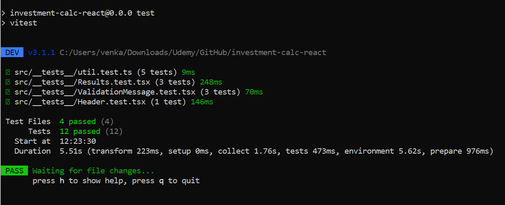
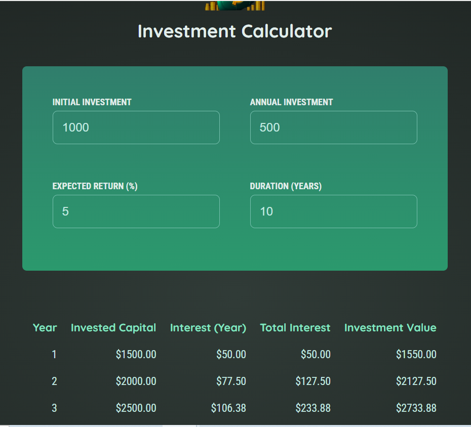

# Investment Calculator - React App

This is a **React + TypeScript** application built with Vite that calculates investment growth over time. This project is **based on a course** assignment but has been extended with additional features, improved design, and unit test coverage as part of independent work.

## 🧱 Project Structure

```
├── index.html                       # Entry HTML file for mounting the React app
├── package.json                     # Project metadata and dependencies
├── public                           # Static assets folder
├── eslint.config.js                 # ESLint configuration
├── tsconfig*.json                   # TypeScript configurations
├── vite.config.ts                   # Vite build and dev server configuration
└── README.md                        # Project overview (this file)
├── src                              # Source code folder
│   ├── App.tsx                      # Root component composing the app UI
│   ├── main.tsx                     # Application entry point, React root rendering
│   ├── index.css                    # Global styles
│   ├── /components                  # Reusable presentational components
│   │   ├── Header.tsx               # Top banner with title/image
│   │   ├── Results.tsx              # Displays calculated investment results
│   │   ├── UserInput.tsx            # Form for user input of investment data
│   │   └── ValidationMessage.tsx    # Conditionally shows validation error message
│   ├── /util                        # Utility/helper logic
│   │   └── investment.ts            # Core investment calculation logic
│   └── /__tests__                   # Unit and integration tests
│       ├── Header.test.tsx          # Tests for Header component
│       ├── Results.test.tsx         # Tests for Results component
│       ├── util.test.ts             # Tests for investment calculation logic
│       └── ValidationMessage.test.tsx # Tests for validation message rendering
```

## Design Highlights

- **React + TypeScript**: Leverages strict typing and component-based architecture.
- **Vite**: Ultra-fast build and dev server setup.

## 📦 Getting Started

Install dependencies:

```bash
npm install
```

Start the development server:

```bash
npm run dev
```

## 🧪 Unit Tests

Unit tests are written using **Vitest + React Testing Library**.

Run all unit tests:

```bash
npm run test
```

All core components and utility functions are covered:

- `Header` rendering
- `Results` layout and values
- `ValidationMessage` conditionals
- `investment.ts` logic correctness

## ✅ Unit Tests in Action



## 🧹 Clean Code

- Descriptive naming conventions
- No unused dependencies

## 📌 Notes

- ESLint and TypeScript configs ensure code quality and developer productivity.

## 🙋‍♂️ Author

This project was completed as part of personal learning based on a React course. All enhancements, design choices, and testing were implemented independently.

Feel free to explore, contribute, or fork!

## ✅ React App in Action


